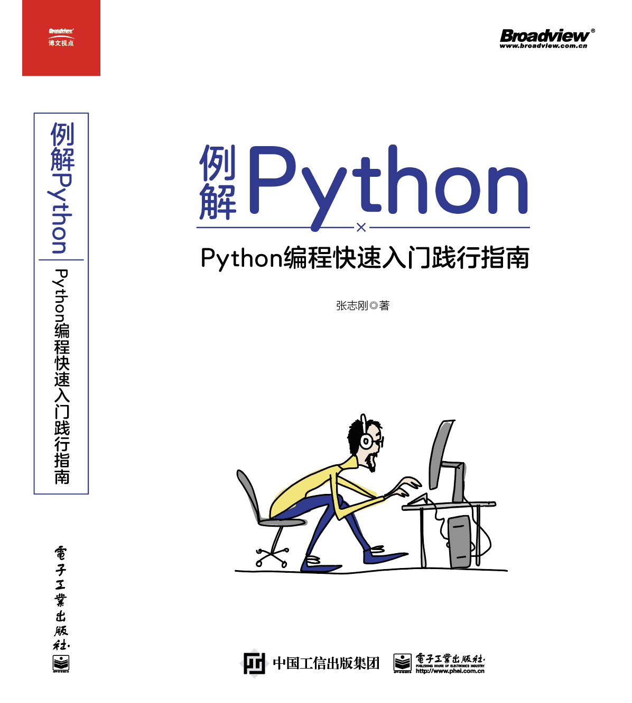

课上笔记如果本地没有任何资料，第一次下载：
```shell
# git clone https://gitee.com/mrzhangzhg/nsd2020.git
```
后续同步：
```shell
# cd nsd2020
# git pull
```

- 我的《Python百例》：https://www.jianshu.com/c/00c61372c46a
- 第五阶段所用到的python软件包及python3环境准备视频讲解: 链接:https://pan.baidu.com/s/1dqsnnRqYKdnte_iX7ashYQ  密码:wayn

<hr>

市面上“从入门到精通”的书很多，但是很时候反而成了“从入门到放弃”。我并不打算以“从入门到精通”的名号，把大家搞到放弃。所以写了一本“从入门到菜鸟”的书。

本书注重基础和编程思路的讲解，通过一系列示例帮助读者顺利入门。

书名为《例解Python》，已由电子工业出版社出版，在京东等各大电商平台有售。[京东链接](https://item.jd.com/13054450.html)

