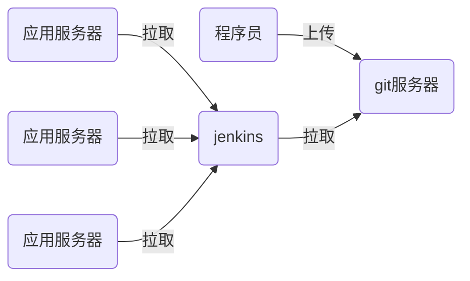

# nsd1912-devops-day04

自动化、容器化、虚拟化、平台化、web化

## CI/CD，持续集成/持续交付

#### 程序分类

- 编译执行：C / C++ / Java / Go
- 解释执行：python / shell / php



## git应用

https://git-scm.com/book/zh/v2

```python
[root@node2 ~]# yum install -y git
[root@node2 ~]# git config --global user.name MrZhangzg
[root@node2 ~]# git config --global user.email zhangzg@tedu.cn
[root@node2 ~]# git config --global core.editor vim
[root@node2 ~]# git config --list
[root@node2 ~]# cat ~/.gitconfig 
```

- git中三个重要的区域
  - 工作区：编写代码的项目目录
  - 暂存区：工作区与版本库间的缓冲地带。.git/index
  - 版本库：存放工作区某一时间点的快照。工作区下的.git目录
- 初始化

```shell
# 初始化方法一，不存在项目目录时：
[root@node2 ~]# mkdir projects/
[root@node2 ~]# cd projects/
[root@node2 projects]# git init mytest
初始化空的 Git 版本库于 /root/projects/mytest/.git/
[root@node2 projects]# ls -A mytest/
.git

# 初始化方法二，已存在项目目录
[root@node2 projects]# mkdir myweb
[root@node2 projects]# cd myweb/
[root@node2 myweb]# echo 'Hello World' > index.html
[root@node2 myweb]# git init
初始化空的 Git 版本库于 /root/projects/myweb/.git/
[root@node2 myweb]# ls -A
.git  index.html
```

- 文件的状态
  - 未跟踪：工作区中的文件，既不存在版本库，也没有出现在暂存区
  - 已暂存：通过git add将文件加入到暂存区
  - 未修改：工作区与版本库中的文件一致
  - 已修改：工作区的文件与版本库的文件不一致

```shell
[root@node2 myweb]# git status
[root@node2 myweb]# git status -s
?? index.html   # 未跟踪
[root@node2 myweb]# git add index.html
[root@node2 myweb]# git status
[root@node2 myweb]# git status -s
A  index.html   # 已暂存
[root@node2 myweb]# git commit -m "pro init"
[root@node2 myweb]# git status   # 未修改
# 位于分支 master
无文件要提交，干净的工作区
[root@node2 myweb]# git status -s
[root@node2 myweb]# echo '2nd line' > index.html 
[root@node2 myweb]# git status
[root@node2 myweb]# git status -s
 M index.html    # 已修改
[root@node2 myweb]# git add .  # 全部文件加入暂存区
[root@node2 myweb]# git status -s
M  index.html    # 已修改
[root@node2 myweb]# git commit -m "modify index.html"
[root@node2 myweb]# git status
# 位于分支 master
无文件要提交，干净的工作区
```

- 通过.gitignore忽略文件

```shell
[root@node2 myweb]# echo '1. 项目1.0要在7月前完成' > 计划.txt
[root@node2 myweb]# ls
index.html  计划.txt
[root@node2 myweb]# git status -s
?? "\350\256\241\345\210\222.txt"
# git add时忽略的文件写入.gitignore
[root@node2 myweb]# echo '计划.txt' >> .gitignore
[root@node2 myweb]# git status -s
?? .gitignore
# .gitignore 文件也支持通配符
[root@node2 myweb]# echo '*.swp' >> .gitignore 
```

- 其他操作

```shell
# 改名
[root@node2 myweb]# git mv index.html index.htm
[root@node2 myweb]# git commit -m "mv index.html index.htm"

# 增加多个文件
[root@node2 myweb]# cp /etc/{hosts,motd,issue} .
[root@node2 myweb]# git add .
[root@node2 myweb]# git commit -m "add files"

# 查看工作区的文件
[root@node2 myweb]# ls
hosts  index.htm  issue  motd  计划.txt
# 查看版本库的文件
[root@node2 myweb]# git ls-files
.gitignore
hosts
index.htm
issue
motd

# 删除issue
[root@node2 myweb]# git rm issue
[root@node2 myweb]# git status -s
D  issue
[root@node2 myweb]# git commit -m "rm issue"

# 文件一旦存入到版本库后，它就不能完全被删除
[root@node2 myweb]# git log 
commit 375c1b27a72221943439dd8fa5aca5365cd0f6c3
Author: MrZhangzg <zhangzg@tedu.cn>
Date:   Tue Jun 2 11:21:16 2020 +0800

    rm issue

commit 771bf74145c33882a010d53bd01f88b3167a84ab
Author: MrZhangzg <zhangzg@tedu.cn>
Date:   Tue Jun 2 11:18:23 2020 +0800

    add files

# 将head指针移动到删除文件前的提交
[root@node2 myweb]# git checkout 771bf74145c33882a010d53bd01f88b3167a84ab
[root@node2 myweb]# ls
hosts  index.htm  issue  motd  计划.txt

# 移动head指针到最新提交状态
[root@node2 myweb]# git checkout master
[root@node2 myweb]# ls
hosts  index.htm  motd  计划.txt


# 撤销对工作区的修改
[root@localhost ~]# cp -r nsd2019 /tmp/
[root@localhost ~]# cd /tmp/nsd2019/
[root@localhost nsd2019]# du -sh .
102M	.
[root@localhost nsd2019]# rm -rf *
[root@localhost nsd2019]# ls
[root@localhost nsd2019]# du -sh .
29M	.
# 恢复工作区
[root@localhost nsd2019]# git status | head
[root@localhost nsd2019]# git checkout -- *
[root@localhost nsd2019]# du -sh .
101M	.
```

### tag标记

- Git 可以给仓库历史中的某一个提交打上标签，以示重要。
- 比较有代表性的是人们会使用这个功能来标记发布结点（版本，如1.0，2.0）

```shell
# 查询tag
[root@node2 myweb]# git tag
# 将当前提交标记为1.0
[root@node2 myweb]# git tag 1.0
# 继续提交
[root@node2 myweb]# echo 'version 2.0' >> index.htm 
[root@node2 myweb]# git add .
[root@node2 myweb]# git commit -m "app ver 2.0"
# 标记本次提交为2.0
[root@node2 myweb]# git tag 2.0
[root@node2 myweb]# git tag
1.0
2.0
```

### 管理分支

- git创建后拥有一个名为master的分支
- master分支与用户新建的其他分支没有区别
- Git 的分支，其实本质上仅仅是指向提交对象的可变指针。
- Git 的默认分支名字是 `master`。在多次提交操作之后，你其实已经有一个指向最后那个提交对象的 `master` 分支。
- `master` 分支会在每次提交时自动向前移动。
- Git 是怎么创建新分支的呢？很简单，它只是为你创建了一个可以移动的新的指针。

```shell
# 查看分支
[root@localhost myweb]# git branch 
* master

# 创建名为testing的分支
[root@node2 myweb]# git branch testing
[root@node2 myweb]# git branch 
* master
  testing
# 新建分支，并不会切换到新建分支上。查看分支时，当前所处分支有＊号指示
```

- Git 又是怎么知道当前在哪一个分支上呢？也很简单，它有一个名为 `HEAD` 的特殊指针。
- `HEAD` 是一个指针，指向当前所在的本地分支
- 程序员在每个分支上都可以提交代码

```shell
# 在master上提交代码
[root@node2 myweb]# touch master.txt
[root@node2 myweb]# git add .
[root@node2 myweb]# git commit -m "add master.txt"
[root@node2 myweb]# ls
hosts  index.htm  master.txt  motd  计划.txt

# 切换到testing
[root@node2 myweb]# git checkout testing 
切换到分支 'testing'
[root@node2 myweb]# ls  # 目录中没有master.txt
hosts  index.htm  motd  计划.txt
[root@node2 myweb]# git branch 
  master
* testing

# 在testing分支上提交代码
[root@node2 myweb]# touch test.txt
[root@node2 myweb]# git add .
[root@node2 myweb]# git commit -m 'add test.txt'
[root@node2 myweb]# ls
hosts  index.htm  motd  test.txt  计划.txt

# 切回到master分支
[root@node2 myweb]# git checkout master
[root@node2 myweb]# ls
hosts  index.htm  master.txt  motd  计划.txt

# 合并testing分支到master
[root@node2 myweb]# git branch 
* master
  testing
[root@node2 myweb]# git merge testing -m "merge testing"
[root@node2 myweb]# ls
hosts  index.htm  master.txt  motd  test.txt  计划.txt

# 删除分支
[root@node2 myweb]# git branch -d testing 
已删除分支 testing（曾为 196e4ea）。
[root@node2 myweb]# git branch 
* master
```

## gitlab服务器

- 安装

```shell
[root@gitserver ~]# yum install -y docker
[root@gitserver ~]# systemctl start docker
[root@gitserver ~]# systemctl enable docker
[root@gitserver ~]# cd docker_gitlab/images/
[root@gitserver images]# docker load -i gitlab_zh.tar 
# 因为gitlab容器也需要使用22端口，所以把宿主机ssh端口改为2022
[root@gitserver images]# vim /etc/ssh/sshd_config 
Port 2022
[root@gitserver images]# systemctl restart sshd
# 退出ssh连接后，再登陆
[root@localhost ~]# ssh 192.168.81.134 -p 2022

# 启动gitlab容器
[root@gitserver ~]# docker run -d -h gitlab --name gitlab -p 443:443 -p 80:80 -p 22:22 --restart always -v /srv/gitlab/config:/etc/git/gitlab -v /srv/gitlab/logs:/var/log/gitlab -v /srv/gitlab/data:/var/opt/gitlab gitlab_zh:latest 

# 查看容器启动状态，注意状态变为healthy时才完全可用
[root@gitserver ~]# docker ps 
```

- 配置git服务器，通过浏览器访问http://xx.x.x。第一次登陆为root用户配置密码，必须8位以上，符合复杂性要求。
- 在gitlab中重要的三个组成部分
  - 用户：使用gitlab的人
  - 组：对应开发团队
  - 项目：对应软件项目。可以为个人或组创建项目
- 创建名为devops的组，组类型是公开的。
- 创建一个普通用户。创建用户时，不能为其设置密码。创建后，编辑他，可以设置。
- 修改组设置，将新建用户添加到devops组中，作为主程序员。
- 创建名为myweb的项目，项目为公开的，为devops组创建

#### 上传代码

- 用户在第一次登陆时需要改密码。所以在上传前先使用普通用户登陆并修改密码。
- 用户修改密码时，新老密码可以一样。

```shell
# 查看远程仓库
[root@node2 myweb]# git remote -v
# 添加远程仓库
[root@node2 myweb]# git remote add origin http://192.168.81.134/devops/myweb.git
[root@node2 myweb]# git remote -v
origin	http://192.168.81.134/devops/myweb.git (fetch)
origin	http://192.168.81.134/devops/myweb.git (push)
# 推送代码
[root@node2 myweb]# git push -u origin --all
Username for 'http://192.168.81.134': zzg
Password for 'http://zzg@192.168.81.134': 
# tag标签需要单独推送
[root@node2 myweb]# git push -u origin --tags
Username for 'http://192.168.81.134': zzg
Password for 'http://zzg@192.168.81.134': 
```

- 采用ssh免密上传代码

```shell
# 在客户端上生成密钥
[root@node2 myweb]# ssh-keygen 
[root@node2 myweb]# cat ~/.ssh/id_rsa.pub 
ssh-rsa AAAAB3NzaC1yc2EAAAADAQABAAABAQC/DwAD3aLuC23ECLwPAuGVv7xR25fg/zmo81L33OoaoxupBCPX78+9m1rGOv7XyiZvL81dXKkAYjIwrMON5aoyDAl3tm5xCMbXTZIrQI6yN9HU+NyaArwDmQwoJvrw2IPDsKlCs4xAxJ86Nnf3NsZ42FdFid2gMCKdqO1NYjQPytREDN9Pt176U6juJ2CBCEbMrJQJv7hhTBlw07ITmd8KkLYDbAzZ0pv/WxrR2tW2T6oMc5j8dzUbXCVpeG/1JYlHRTV3qeMLZlKeAoXvbtSVQjhU3DkcmUVbFLCKTniJlXHW9bx46K+zG72kGVIrlxPwx1T6+ybtLNRk7gTrM8wP root@localhost

# web页右上角用户 -> 设置 -> 左边栏ssh密钥 -> 将上面查看到的公钥粘贴到web中的密钥文本框中 -> 增加密钥

# 在客户端修改远程仓库的上传形式为ssh
[root@node2 myweb]# git remote remove origin 
[root@node2 myweb]# git remote add origin git@192.168.81.134:devops/myweb.git

# 测试
[root@node2 myweb]# cp /etc/passwd .
[root@node2 myweb]# git add .
[root@node2 myweb]# git commit -m "add passwd"
[root@node2 myweb]# git push
```

#### 准备明天用到的软件：

```shell
[root@localhost ~]# wget https://mirrors.tuna.tsinghua.edu.cn/jenkins/redhat-stable/jenkins-2.222.1-1.1.noarch.rpm
```

