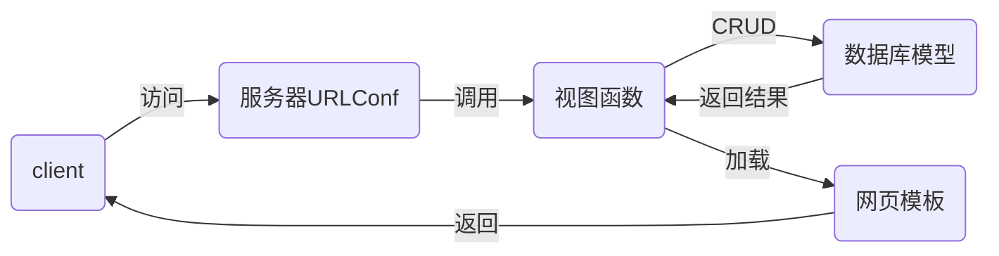

# nsd1912-devweb-day03

## django

- 它是一个web框架。其他常用的web框架还有flask / tornado
- django的1.11和2.2都是LTS版，即长期支持版

```shell
# 查看版本
[root@db1 day0304]# pip3 install django==
# 安装
[root@db1 day0304]# pip3 install django==1.11.6
[root@db1 day0304]# python3 -m django --version
1.11.6
```

### MTV模式

- Model：数据库模型
- Template：网页模板
- Views：视图函数



## 初始化django项目

- 创建项目方法一：

```shell
[root@db1 day0304]# django-admin startproject mytest
[root@db1 day0304]# ls
mytest  
```

- 创建项目方法二：通过pycharm直接创建

file -> New project -> django

- 项目目录结构

```shell
[root@db1 mysite]# tree .
.                        # 项目的根目录
├── manage.py            # 项目的管理文件
├── mysite               # 项目的配置目录
│   ├── __init__.py      # 项目初始化文件
│   ├── settings.py      # 项目配置文件
│   ├── urls.py          # 路由文件
│   └── wsgi.py          # 部署项目到web服务器的配置文件
└── templates            # pycharm创建的，用于存储网页模板的目录
```

- 启动开发服务器

```shell
[root@db1 mysite]# python3 manage.py runserver
# 访问http://127.0.0.1:8000/
```

- 配置项目

```shell
# 准备名为dj1912的mysql数据库
[root@db1 nsd2019]# mysql -uroot -ptedu.cn
MariaDB [(none)]> CREATE DATABASE dj1912 DEFAULT CHARSET utf8;

# mysite/settings.py
# BASE_DIR定义项目的根目录
BASE_DIR = os.path.dirname(os.path.dirname(os.path.abspath(__file__)))
ALLOWED_HOSTS = ['*']   # 允许通过本机的任意地址进行访问
DATABASES = {
    'default': {
        'ENGINE': 'django.db.backends.mysql',
        'NAME': 'dj1912',
        'USER': 'root',
        'PASSWORD': 'tedu.cn',
        'HOST': '127.0.0.1',
        'PORT': '3306',
    }
}
LANGUAGE_CODE = 'zh-hans'
TIME_ZONE = 'Asia/Shanghai'
USE_TZ = False

# 设置django可以正确的连接到mysql数据库
# mysite/__init__.py
import pymysql

pymysql.install_as_MySQLdb()
```

- 重启开发服务器：按ctrl + c停止

```shell
# 让开发服务器监听在0.0.0.0的80端口
[root@db1 mysite]# python3 manage.py runserver 0:80
```

- 生成django默认应用所需的数据库表

```shell
[root@db1 mysite]# python3 manage.py makemigrations
[root@db1 mysite]# python3 manage.py migrate
```

- 创建管理员用户

```shell
[root@db1 mysite]# python3 manage.py createsuperuser
Username (leave blank to use 'root'): admin
Email address: admin@tedu.cn
Password: 1234.com
Password (again): 1234.com
Superuser created successfully.
```

- 启动开发服务器，访问后台管理页面

```shell
[root@db1 mysite]# python3 manage.py runserver
# 访问http://127.0.0.1/admin
```

- 项目由应用构成。一个项目可以包含很多应用。一个应用可以部署到多个项目中。
- 创建名为polls的应用

```shell
# 创建应用
[root@db1 mysite]# python3 manage.py startapp polls
[root@db1 mysite]# ls
db.sqlite3  manage.py  mysite  polls  templates

# 集成应用到项目
# mysite/settings.py
INSTALLED_APPS = [
    ... ...
    'polls',
]
```

## 配置应用

- 运行前一个班的投票应用

```shell
[root@db1 mysite]# cp -r /root/nsd2019/nsd1910/devweb/day0304/mysite/ /tmp/
[root@db1 nsd2019]# cd /tmp/mysite/
[root@db1 mysite]# mysql -uroot -ptedu.cn
MariaDB [(none)]> CREATE DATABASE dj1910 DEFAULT CHARSET utf8;
[root@db1 mysite]# vim mysite/settings.py  # 修改数据库密码
[root@db1 mysite]# rm -f polls/migrations/000*
[root@db1 mysite]# python3 manage.py makemigrations
[root@db1 mysite]# python3 manage.py migrate
[root@db1 mysite]# python3 manage.py createsuperuser
Username (leave blank to use 'root'): admin
Email address: admin@tedu.cn
Password: 
Password (again): 
Superuser created successfully.
# 启运开发服务器，让它运行在0.0.0.0的9000端口
[root@db1 mysite]# python3 manage.py runserver 0:9000
# 访问http://127.0.0.1:9000/polls/
# 在后台http://127.0.0.1:9000/admin/添加问题和选项
```

### 应用url规划

- http://127.0.0.1/polls/：投票应用首页，用于显示所有的投票
- http://127.0.0.1/polls/1/：1号问题投票详情，用于实现投票表单
- http://127.0.0.1/polls/1/result/：1号问题投票结果，显示选项票数
- 授权，将应用的url交给应用处理

```shell
# mysite/urls.py
from django.conf.urls import url, include
from django.contrib import admin

urlpatterns = [
	# django将从http://x.x.x.x/后面开始匹配
    url(r'^admin/', admin.site.urls),
    url(r'^polls/', include('polls.urls')),
]

# vim polls/urls.py
from django.conf.urls import url

urlpatterns = []

```

### 初步实现投票首页

```python
# 1. 配置url
# polls/urls.py
from django.conf.urls import url
from polls import views

urlpatterns = [
    # 从http://x.x.x.x/polls/后面开始匹配
    # 如果用户访问http://x.x.x.x/polls/，则调用views.index函数
    # 将http://x.x.x.x/polls/这个url起名为index
    url(r'^$', views.index, name='index'),
]

# 2. 创建views.index函数
# polls/views.py
from django.shortcuts import render

# 用户发起的请求，将会被django作为第一个参数传给函数，所以函数需要有一个参数
def index(request):
    # 通过render函数找到名为index.hml的网页模板文件，返回给用户
    return render(request, 'index.html')

# 3. 制作模板文件
# templates/index.html
<!DOCTYPE html>
<html lang="en">
<head>
    <meta charset="UTF-8">
    <title>投票首页</title>
</head>
<body>
<h1>投票首页</h1>
</body>
</html>

# 4.访问http://x.x.x.x/polls/
```

### 初步实现投票详情页

```python
# polls/urls.py
from django.conf.urls import url
from polls import views

urlpatterns = [
    # 从http://x.x.x.x/polls/后面开始匹配
    # 如果用户访问http://x.x.x.x/polls/，则调用views.index函数
    # 将http://x.x.x.x/polls/这个url起名为index
    url(r'^$', views.index, name='index'),
    # \d+匹配问题id，加上()后，它将作为detail的参数
    url(r'^(\d+)/$', views.detail, name='detail'),
]

# polls/views.py
... ...
def detail(request, q_id):
    # q_id用于接收从url传来的参数
    # 字典中的内容将以关键字参数key=val的形式传给网页模板，如q_id=10
    return render(request, 'detail.html', {'q_id': q_id})

# templates/detail.html
<!DOCTYPE html>
<html lang="en">
<head>
    <meta charset="UTF-8">
    <title>投票详情</title>
</head>
<body>
<h1>{{ q_id }}号问题投票详情</h1>
</body>
</html>

# 访问http://x.x.x.x/polls/数字
```

### 初步实现投票结果页

```shell
# polls/urls.py
from django.conf.urls import url
from polls import views

urlpatterns = [
    # 从http://x.x.x.x/polls/后面开始匹配
    # 如果用户访问http://x.x.x.x/polls/，则调用views.index函数
    # 将http://x.x.x.x/polls/这个url起名为index
    url(r'^$', views.index, name='index'),
    # \d+匹配问题id，加上()后，它将作为detail的参数
    url(r'^(\d+)/$', views.detail, name='detail'),
    url(r'^(\d+)/result/$', views.result, name='result'),
]

# polls/views.py
def result(request, qid):
    return render(request, 'result.html', {'qid': qid})

# templates/result.html
<!DOCTYPE html>
<html lang="en">
<head>
    <meta charset="UTF-8">
    <title>投票结果</title>
</head>
<body>
<h1>{{ qid }}号问题投票结果</h1>
</body>
</html>

# 访问http://127.0.0.1:8000/polls/数字/result/
```

## 创建模型

- django的数据库模型采用的是ORM
- Object：对象
- Relationship：关系
- Mapper：映射
- 数据库中的表与class映射
- 表的字段与类变量映射
- 表中的记录与class的实例对象映射
- 数据库中的每种数据类型，django都提前创建好了相应的class

### 创建模型

- 问题模型

```python
# polls/models.py
from django.db import models

class Question(models.Model):
    question_text = models.CharField(max_length=200)
    pub_date = models.DateTimeField()


# 生成表
[root@db1 mysite]# python3 manage.py makemigrations
[root@db1 mysite]# python3 manage.py migrate
MariaDB [dj1911]> show tables;
| polls_question             |
MariaDB [dj1911]> DESC polls_question;
+---------------+--------------+------+-----+---------+----------------+
| Field         | Type         | Null | Key | Default | Extra          |
+---------------+--------------+------+-----+---------+----------------+
| id            | int(11)      | NO   | PRI | NULL    | auto_increment |
| question_text | varchar(200) | NO   |     | NULL    |                |
| pub_date      | datetime     | NO   |     | NULL    |                |
+---------------+--------------+------+-----+---------+----------------+

# 分析：
# 表名的构成：1. 全部为小写字母； 2. 表名=应用名_class名
# 表结构：1. 没有明确声明主键，django自动创建名为id的主键，主键自动增长
# 2. 类变量自动成为表的字段； 3. IntegerField对应INT
# 4. CharField对应varchar; 5. DateTimeField对应datetime类型
```

- 选项模型

```python
# polls/models.py
... ...
class Choice(models.Model):
    choice_text = models.CharField(max_length=100)
    votes = models.IntegerField(default=0)
    q = models.ForeignKey(Question)

# 生成表
[root@db1 mysite]# python3 manage.py makemigrations
[root@db1 mysite]# python3 manage.py migrate

# 分析表结构
# 与polls_question具有一样的格式。其中注意外键字段q，它的构成是：类变量_id
# 如果类变量是question，那么字段名就是question_id

# 修改外键字段名。注意：不要手工修改数据库表
# polls/models.py
class Choice(models.Model):
    choice_text = models.CharField(max_length=100)
    votes = models.IntegerField(default=0)
    question = models.ForeignKey(Question)
[root@db1 mysite]# python3 manage.py makemigrations
Did you rename choice.q to choice.question (a ForeignKey)? [y/N] y
[root@db1 mysite]# python3 manage.py migrate
MariaDB [dj1911]> desc polls_choice;
```

- 将模型注册到管理后台

```python
# polls/admin.py
from django.contrib import admin
from polls.models import Question, Choice

admin.site.register(Question)
admin.site.register(Choice)

# 访问http://127.0.0.1:8000/admin
# 添加问题后，显示的全部是Question object。为了显示指定内容，可以修改模型
# polls/models.py
from django.db import models

class Question(models.Model):
    question_text = models.CharField(max_length=200)
    pub_date = models.DateTimeField()
    
    def __str__(self):
        return "问题:%s" % self.question_text

class Choice(models.Model):
    choice_text = models.CharField(max_length=100)
    votes = models.IntegerField(default=0)
    question = models.ForeignKey(Question)
    
    def __str__(self):
        return "%s=>[%s]" % (self.question, self.choice_text)
# 访问http://127.0.0.1:8000/admin
```