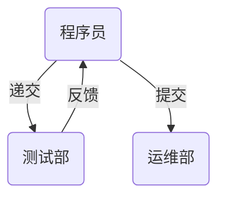
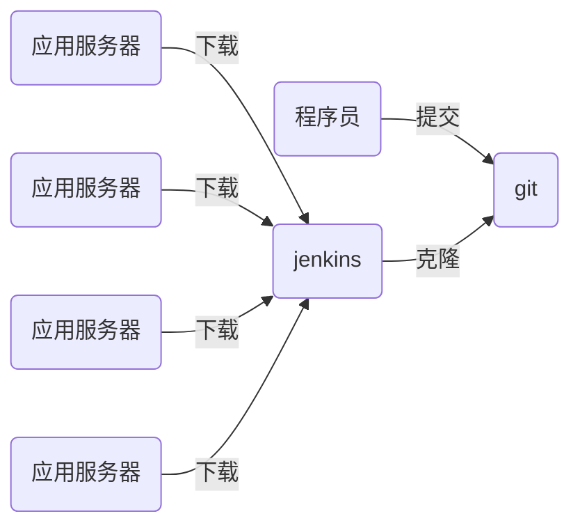

# nsd2002-devops-day04

[TOC]

## CI/CD

- CI/CD：持续集成、持续交付

- 程序传统上线流程



- 程序语言分类
  - 解释执行：python / shell / php
  - 编译执行：c / c++ / go / java

- CI/CD流程



## git应用

- 安装与配置

```shell
[root@dev ~]# yum install -y git
[root@dev ~]# git config --global user.name zhangzhg
[root@dev ~]# git config --global user.email zhangzg@tedu.cn
[root@dev ~]# git config --global core.editor vim
[root@dev ~]# git config --list
user.name=zhangzhg
user.email=zhangzg@tedu.cn
core.editor=vim
```


