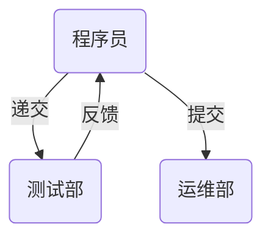
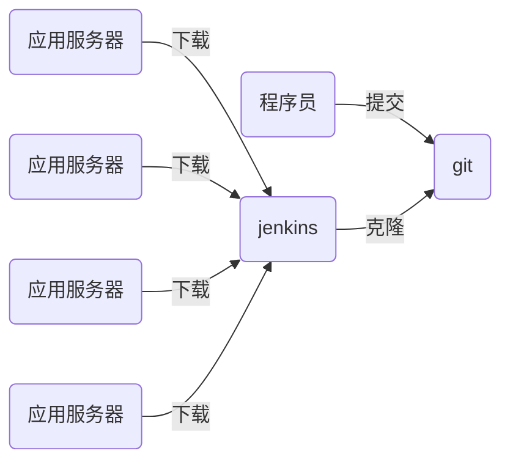

# nsd2002-devops-day04

[TOC]

## CI/CD

- CI/CD：持续集成、持续交付

- 程序传统上线流程



- 程序语言分类
  - 解释执行：python / shell / php
  - 编译执行：c / c++ / go / java

- CI/CD流程



## git应用

- 安装与配置

```shell
[root@dev ~]# yum install -y git
[root@dev ~]# git config --global user.name zhangzhg
[root@dev ~]# git config --global user.email zhangzg@tedu.cn
[root@dev ~]# git config --global core.editor vim
[root@dev ~]# git config --list
user.name=zhangzhg
user.email=zhangzg@tedu.cn
core.editor=vim
```

- 电子书推荐：https://git-scm.com/book/zh/v2
- git重要的工作区域
  - 工作区：项目目录
  - 暂存区：工作区和版本库之间的缓冲地带，也叫stage或index。位于.git/index
  - 版本库：快照存储区域，工作区下的.git目录


- 文件状态
  - 未跟踪：工作区中的文件，尚未执行add操作
  - 已跟踪：
    - 已暂存：通过git add将文件放到暂存区
    - 未修改：git commit后，没有再做修改。工作区文件内容与版本库中的一致
    - 已修改：git commit后，修改文件，但是没有执行git add操作

- 操作

```shell
# 创建版本库，方法一
[root@dev ~]# mkdir projects; cd projects
[root@dev projects]# git init mytest
初始化空的 Git 版本库于 /root/projects/mytest/.git/
[root@dev projects]# ls
mytest
[root@dev projects]# ls -A mytest/
.git

# 创建版本库，方法二
[root@dev projects]# mkdir myweb; cd myweb
[root@dev myweb]# echo 'Hello World' > readme.md
[root@dev myweb]# git init
初始化空的 Git 版本库于 /root/projects/myweb/.git/
[root@dev myweb]# ls -A
.git  readme.md

# 查看文件状态
[root@dev myweb]# git status
# 位于分支 master
#
# 初始提交
#
# 未跟踪的文件:
#   （使用 "git add <file>..." 以包含要提交的内容）
#
#	readme.md
提交为空，但是存在尚未跟踪的文件（使用 "git add" 建立跟踪）

# 暂存目录下所有文件
[root@dev myweb]# git add .
[root@dev myweb]# git status
# 位于分支 master
#
# 初始提交
#
# 要提交的变更：
#   （使用 "git rm --cached <file>..." 撤出暂存区）
#
#	新文件：    readme.md
#

# 提交文件
[root@dev myweb]# git commit -m "project init"

# 修改文件
[root@dev myweb]# echo '2nd line' > readme.md 
[root@dev myweb]# git status
# 位于分支 master
# 尚未暂存以备提交的变更：
#   （使用 "git add <file>..." 更新要提交的内容）
#   （使用 "git checkout -- <file>..." 丢弃工作区的改动）
#
#	修改：      readme.md
#
修改尚未加入提交（使用 "git add" 和/或 "git commit -a"）

# 创建.gitignore来阻止某些文件加入到跟踪
[root@dev myweb]# echo '8-1 xxxx' > plan.txt
[root@dev myweb]# echo '8-2 aaaa' >> plan.txt 
[root@dev myweb]# vim .gitignore
plan.txt
*.swp
.gitignore
[root@dev myweb]# git status
# 位于分支 master
# 尚未暂存以备提交的变更：
#   （使用 "git add <file>..." 更新要提交的内容）
#   （使用 "git checkout -- <file>..." 丢弃工作区的改动）
#
#	修改：      readme.md
#
修改尚未加入提交（使用 "git add" 和/或 "git commit -a"）
```

