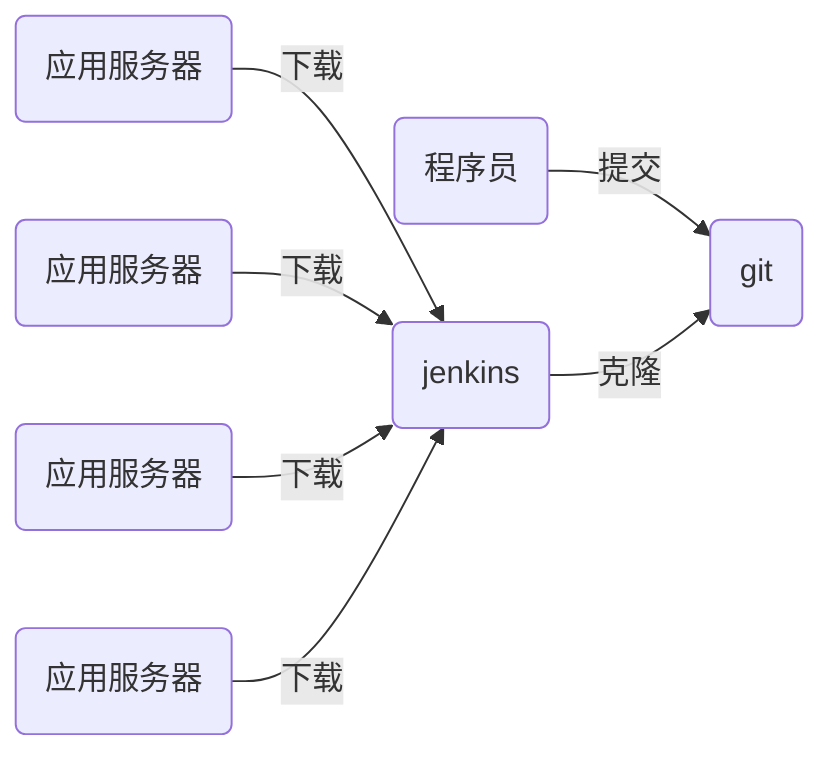

# nsd2002-devops-day05

[TOC]

## jenkins



- Jenkins是由java编写的一款开源软件
- 作为一款非常流行的CI（持续集成）工具，用于构建和测试各种项目
- Jenkins 的主要功能是监视重复工作的执行，例如软件工程的构建或在cron下设置的jobs 

- 持续集成（CI）是当下最为流行的应用程序开发实践方式
- 程序员在代码仓库中集成了修复bug、新特性开发或是功能革新
- CI工具通过自动构建和自动测试来验证结果。这可以检测到当前程序代码的问题，迅速提供反馈

- 安装

```shell
[root@jenkins ~]# rpm -qa | grep java
java-1.8.0-openjdk-1.8.0.161-2.b14.el7.x86_64
[root@jenkins ~]# rpm -ihv jenkins-2.235.3-1.1.noarch.rpm 
[root@jenkins ~]# systemctl start jenkins
[root@jenkins ~]# systemctl enable jenkins
# 访问 http://x.x.x.x:8080
```

- 在/var/lib/jenkins/secrets/initialAdminPassword取出密码 -> 选择插件来安装  -> 点击中间上面的“无”，不安装任何插件，点击右下角的“安装” -> 点击右下角的“使用admin继续” ->  点击“保存并完成” -> 点击"开始使用jenkins"
- 进入jenkins首页后，改admin密码

右上角的"admin" -> configure -> password

- 配置通过国内站点安装插件

```
[root@localhost ~]# ls /var/lib/jenkins/updates/default.json 
[root@localhost ~]# sed -i 's/http:\/\/updates.jenkins-ci.org\/download/https:\/\/mirrors.tuna.tsinghua.edu.cn\/jenkins/g' /var/lib/jenkins/updates/default.json && sed -i 's/http:\/\/www.google.com/https:\/\/www.baidu.com/g' /var/lib/jenkins/updates/default.json
[root@localhost ~]# systemctl restart jenkins
```

> 如果/var/lib/jenkins/updates/default.json不存在，可以 Manage Jenkins -> Manage Plugins -> Advanced选项卡 -> Update site : <https://mirrors.tuna.tsinghua.edu.cn/jenkins/updates/update-center.json> -> 点击submit提交。

####  插件

- 安装插件

Manage Jenkins -> Manage Plugins ->  Available选项卡，按ctrl+f进行搜索并勾选Git Parameter / Localization  Chinese(Simplified) / DingTalk / GitLab -> 点击Install without restart  -> 勾选Restart Jenkins when installation is complete and no jobs are  running


