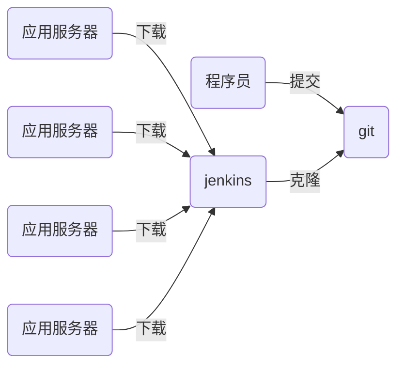

# nsd2002-devops-day05

[TOC]

## jenkins



- Jenkins是由java编写的一款开源软件
- 作为一款非常流行的CI（持续集成）工具，用于构建和测试各种项目
- Jenkins 的主要功能是监视重复工作的执行，例如软件工程的构建或在cron下设置的jobs 

- 持续集成（CI）是当下最为流行的应用程序开发实践方式
- 程序员在代码仓库中集成了修复bug、新特性开发或是功能革新
- CI工具通过自动构建和自动测试来验证结果。这可以检测到当前程序代码的问题，迅速提供反馈

- 安装

```shell
[root@jenkins ~]# rpm -qa | grep java
java-1.8.0-openjdk-1.8.0.161-2.b14.el7.x86_64
[root@jenkins ~]# rpm -ihv jenkins-2.235.3-1.1.noarch.rpm 
[root@jenkins ~]# systemctl start jenkins
[root@jenkins ~]# systemctl enable jenkins
# 访问 http://x.x.x.x:8080
```

- 在/var/lib/jenkins/secrets/initialAdminPassword取出密码 -> **选择插件来安装**  -> 点击中间上面的“无”，不安装任何插件，点击右下角的“安装” -> 点击右下角的“使用admin继续” ->  点击“保存并完成” -> 点击"开始使用jenkins"
- 进入jenkins首页后，改admin密码

右上角的"admin" -> configure -> password

- 配置通过国内站点安装插件

```shell
[root@localhost ~]# ls /var/lib/jenkins/updates/default.json 
[root@localhost ~]# sed -i 's/http:\/\/updates.jenkins-ci.org\/download/https:\/\/mirrors.tuna.tsinghua.edu.cn\/jenkins/g' /var/lib/jenkins/updates/default.json && sed -i 's/http:\/\/www.google.com/https:\/\/www.baidu.com/g' /var/lib/jenkins/updates/default.json
[root@localhost ~]# systemctl restart jenkins
```

> 如果/var/lib/jenkins/updates/default.json不存在，可以 Manage Jenkins -> Manage Plugins -> Advanced选项卡 -> Update site : <https://mirrors.tuna.tsinghua.edu.cn/jenkins/updates/update-center.json> -> 点击submit提交。

####  插件

- 安装插件

Manage Jenkins -> Manage Plugins ->  Available选项卡，按ctrl+f进行搜索并勾选Git Parameter / Localization:  Chinese(Simplified) / DingTalk / GitLab -> 点击Install without restart  -> 勾选Restart Jenkins when installation is complete and no jobs are  running

##  jenkins应用

- 在jenkins服务器上安装git

```shell
[root@jenkins ~]# yum install -y git
```

- 新建任务

首页 -> 新建Item -> myweb / Freestyle project -> 确定 -> 源码管理 => git / Repository URL: <http://192.168.1.102/devops/myweb.git> -> 保存

```shell
# 在jenkins服务器上查看代码目录
[root@localhost ~]# ls /var/lib/jenkins/workspace
ls: 无法访问/var/lib/jenkins/workspace: 没有那个文件或目录
```

点击项目页面左边栏的Build Now(立即构建) -> Build History 下面的#1 -> 左边栏的控制台输出

```shell
# 在jenkins服务器上查看代码目录
[root@localhost ~]# ls /var/lib/jenkins/workspace
myweb
```

####  配置机器人发送消息

- 项目构建过程中，可以将整个构建过程通过机器人发送消息。

首页 -> Manage Jenkins -> Configure System -> 系统配置 -> 新增机器人 -> 输入名字、webhook地址以及关键字 -> 点击测试 -> 成功后保存

> web登陆：<https://im.dingtalk.com/>

- 修改myweb项目，用钉钉机器人发送构建过程

首页 -> 点击项目 - > 左边栏 配置 -> 勾选机器人 -> 保存

构建项目时，构建过程将会通过机器人发送消息

####  推送代码时自动构建项目

- 修改jenkins项目配置 -> 构建触发器 -> 勾选Build when a change is pushed to GitLab. GitLab webhook URL: <http://192.168.1.103:8080/project/myweb> -> 点击 高级 -> 点击generate生成Secret token并复制它 -> 保存
- 修改gitlab配置 -> 点击项目，如myweb -> 左边栏 设置 / 集成 -> 链接url <http://192.168.1.103:8080/project/myweb>  / 安全令牌填写jenkins中生成的Secret token ->  点击增加web钩子。在页面中间部分找到创建的web钩子，点击test -> Push events测试，返回Hook executed  successfully: HTTP 200表示成功。
- 测试

```shell
# 在jenkins服务器上删除构建目录
[root@localhost ~]# rm -rf /var/lib/jenkins/workspace/*

# 程序员推送代码
[root@node2 myprojects]# cd myweb/
[root@node2 myweb]# echo 'new line.' >> index.html
[root@node2 myweb]# git add .
[root@node2 myweb]# git commit -m "modify index.html"
[root@node2 myweb]# git push
```

程序员推送代码到gitlab服务器后，jenkins项目将会自动构建，并通过机器人发送构建消息。

```shell
[root@localhost ~]# ls /var/lib/jenkins/workspace/
myweb
```

###  使用参数git parameter构建某一版本的代码

- 配置jenkins通过tag标签构建

首页 -> 新建Item -> 名字myweb2 / Freestyle project -> 勾选This  project is parameterized参数化构建 => 添加参数 => Git Parameter (Git参数)  => Name: webver / Parameter Type: Branch or Tag / Default Value:  origin/master -> 源码管理 => Git => Repositories => Repository  url: <http://192.168.1.102/devops/myweb.git> / Branches to build: $webver -> 保存

- 构建测试

点击 Build with Parameters -> 选择版本 -> 开始构建

####  检出代码到子目录

```shell
# 删除jenkins服务器上的代码目录
[root@localhost ~]# rm -rf /var/lib/jenkins/workspace/myweb2/
```

在jenkins的web页面上点击配置 -> 在源码管理下面找到Addtional Behaviours -> 新增  -> Checkout to a sub-directory(检出到子目录): myweb-$webver -> 保存

- 构建测试：构建两次，每次使用不同版本

点击 Build with Parameters -> 选择版本 -> 开始构建

```shell
[root@localhost ~]# ls /var/lib/jenkins/workspace/myweb2/
myweb-1.0  myweb-2.0
```

###  修改项目，实现代码打包

- jenkins服务器通过http协议共享打包后的软件
- jenkins服务器发布当前软件版本和前一版本
- 计算压缩包的md5值

```shell
# 在jenkins服务器上安装httpd
[root@localhost ~]# yum install -y httpd
[root@localhost ~]# systemctl start httpd
[root@localhost ~]# systemctl enable httpd
# /var/www/html/deploy/live_ver：保存当前版本号
# /var/www/html/deploy/last_ver：保存前一版本的版本号
# /var/www/html/deploy/pkgs：保存软件的压缩包和它的md5值
[root@localhost ~]# mkdir -p /var/www/html/deploy/pkgs
[root@localhost ~]# chown -R jenkins:jenkins /var/www/html/deploy/
```

- myweb2项目 -> 配置 -> 构建 -> 增加构建项目 -> Execute shell

```shell
pkgs_dir=/var/www/html/deploy/pkgs
# 将下载目录拷贝到web服务器目录
cp -r myweb-$webver $pkgs_dir
cd $pkgs_dir
rm -rf myweb-$webver/.git  # 删除不必要的版本库文件
# 打包
tar czf myweb-$webver.tar.gz myweb-$webver
rm -rf myweb-$webver  # 删除软件目录
# 计算压缩包的md5值
md5sum myweb-$webver.tar.gz | awk '{print $1}' > myweb-$webver.tar.gz.md5
cd ..
# 将live_ver的版本号写到last_ver中
[ -f live_ver ] && cat live_ver > last_ver
echo -n $webver > live_ver  # 将最新版本号写入live_ver
```

- 构建测试

点击 Build with Parameters -> 选择版本 -> 开始构建

- 访问 <http://jenkins服务器ip/deploy> 

### 部署软件到应用服务器

####  在web服务器上部署代码

- 下载相应版本的软件包
- 校验下载的软件包是否损坏
- 解压软件包
- 部署软件包到web服务器的文档目录

```shell
# 在应用服务器上执行以下操作
[root@localhost ~]# yum install -y httpd
[root@localhost ~]# systemctl start httpd
[root@localhost ~]# systemctl enable httpd
[root@localhost ~]# mkdir /var/www/{download,deploy}
# /var/www/download: 用于保存下载的tar包
# /var/www/deploy: 用于保存解压后的目录和live_ver文件
# /var/www/html/nsd2002: web服务器软链接
```

- 编写应用服务器自动上线代码

```python
# vim deploy.py
import os
import requests
import wget
import hashlib
import tarfile


def has_new_ver(ver_url, ver_fname):
    "判断是否有新版本，有返回True，否则为False"
    # 本地不存在版本文件，则有新版本
    if not os.path.isfile(ver_fname):
        return True

    # 如果本地版本和网上版本不一样，则有新版本
    with open(ver_fname) as fobj:
        local_ver = fobj.read()

    r = requests.get(ver_url)
    if local_ver != r.text:
        return True
    else:
        return False


def file_ok(md5url, app_fname):
    "判断文件是否完好，完好返回True，否则为False"
    m = hashlib.md5()
    with open(app_fname, 'rb') as fobj:
        while 1:
            data = fobj.read(4096)
            if not data:
                break
            m.update(data)
    r = requests.get(md5url)
    if m.hexdigest() == r.text.strip():  # 去除文件结尾的\n
        return True
    else:
        return False

def deploy(app_fname, deploy_dir, dest):
    "部署软件"
    # 解压
    tar = tarfile.open(app_fname)
    tar.extractall(path=deploy_dir)
    tar.close()

    # 拼接出解压文件的绝对路径
    app_dir = os.path.basename(app_fname)
    app_dir = app_dir.replace('.tar.gz', '')
    app_dir = os.path.join(deploy_dir, app_dir)

    # 如果软链接已存在，先删除它
    if os.path.exists(dest):
        os.remove(dest)

    # 创建软链接
    os.symlink(app_dir, dest)

if __name__ == '__main__':
    # 判断是否有新版本
    ver_url = 'http://192.168.1.103/deploy/live_ver'
    ver_fname = '/var/www/deploy/live_ver'
    if not has_new_ver(ver_url, ver_fname):
        print('未发现新版本')
        exit(1)

    # 下载新版本软件
    download_dir = '/var/www/download'
    r = requests.get(ver_url)
    app_url = 'http://192.168.1.103/deploy/pkgs/myweb-%s.tar.gz' % r.text
    wget.download(app_url, download_dir)

    # 判断文件是否完好，如果损坏则删除它
    md5url = app_url + '.md5'
    app_fname = os.path.basename(app_url)
    app_fname = os.path.join(download_dir, app_fname)
    if not file_ok(md5url, app_fname):
        os.remove(app_fname)
        exit(2)

    # 部署软件
    deploy_dir = '/var/www/deploy'
    dest = '/var/www/html/nsd2002'
    deploy(app_fname, deploy_dir, dest)

    # 更新live_ver文件
    if os.path.exists(ver_fname):
        os.remove(ver_fname)
    wget.download(ver_url, ver_fname)
```

- 测试

```shell
# 程序员修改代码并推送
[root@dev myweb]# vim index.html 
<h1>Hello World</h1>
new line.
hello tedu
<p>

</p>
[root@dev myweb]# git add .
[root@dev myweb]# git commit -m "modify index.html"
[root@dev myweb]# git tag 4.0
[root@dev myweb]# git push
[root@dev myweb]# git push --tags

# 构建jenkins项目
# 运行自动部署工具（脚本）
# 查看结果http://127.0.0.1/nsd2002/
```

