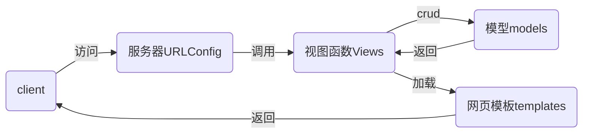

# nsd2002-devweb-day03

## django

### MTV模式



### 配置django

```shell
[root@localhost nsd2020]# cat ~/.pip/pip.conf 
[global]
index-url = http://mirrors.aliyun.com/pypi/simple/
[install]
trusted-host=mirrors.aliyun.com

# 查看django有哪些版本
[root@localhost nsd2020]# pip3 install django==
[root@localhost nsd2020]# pip3 install django==2.2.12
# 查看安装结果
[root@localhost nsd2020]# python3 -m django --version
2.2.12

```

