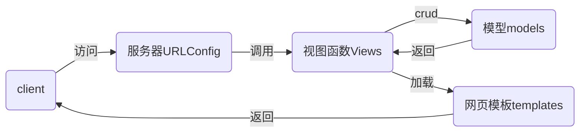

# nsd2002-devweb-day03

## django

### MTV模式



### 配置django

```shell
[root@localhost nsd2020]# cat ~/.pip/pip.conf 
[global]
index-url = http://mirrors.aliyun.com/pypi/simple/
[install]
trusted-host=mirrors.aliyun.com

# 查看django有哪些版本
[root@localhost nsd2020]# pip3 install django==
[root@localhost nsd2020]# pip3 install django==2.2.12
# 查看安装结果
[root@localhost nsd2020]# python3 -m django --version
2.2.12

# 下载python软件包
[root@localhost pypkgs]# pip3 download django==2.2.12 --trusted-host mirrors.aliyun.com
```

- 创建项目方法一

```shell
[root@localhost day0304]# django-admin startproject mytest
[root@localhost day0304]# ls 
mytest
```

- 创建项目方法二，使用pycharm创建：file -> new project -> 弹出窗口，左侧选django；右侧在Location填入项目目录，最后的目录名为mysite

- 项目目录结构

```shell
[root@localhost mysite]# tree .
.                      # 项目根目录
├── manage.py          # 项目管理文件
├── mysite             # 项目配置目录
│   ├── __init__.py    # 初始化文件
│   ├── settings.py    # 项目配置文件
│   ├── urls.py        # 路由文件
│   └── wsgi.py        # 部署项目到web服务器的配置文件
└── templates          # 存放网页模板的目录
```

- 初始化项目

```python
# 为项目创建数据库
[root@localhost pypkgs]# mysql -uroot -ptedu.cn
MariaDB [(none)]> CREATE DATABASE dj2002 DEFAULT CHARSET utf8;

# 修改项目配置文件
# mysite/settings.py
ALLOWED_HOSTS = ['*']   # 监听在哪些地址上
DATABASES = {
    'default': {
        'ENGINE': 'django.db.backends.mysql',
        'NAME': 'dj2002',
        'USER': 'root',
        'PASSWORD': 'tedu.cn',
        'HOST': '127.0.0.1',
        'PORT': '3306',
    }
}
LANGUAGE_CODE = 'zh-hans'   # 修改语言
TIME_ZONE = 'Asia/Shanghai'

# 启动开发服务器
[root@localhost mysite]# python3 manage.py runserver
# 报错如下：
... ...
Did you install mysqlclient?
# 解决方法
[root@localhost mysite]# yum install -y mariadb-devel
[root@localhost mysite]# pip3 install mysqlclient
# 再次启动开发服务器
[root@localhost mysite]# python3 manage.py runserver
# 访问http://127.0.0.1:8000/
```

- 生成项目默认的数据库

```shell
# 生成数据库
[root@localhost mysite]# python3 manage.py makemigrations
[root@localhost mysite]# python3 manage.py migrate
# 创建管理员用户
[root@localhost mysite]# python3 manage.py createsuperuser
用户名 (leave blank to use 'root'): admin
电子邮件地址: admin@tedu.cn
Password: 1234.com
Password (again): 1234.com
Superuser created successfully.
# 访问管理后台http://127.0.0.1:8000/admin
```

### 配置应用

- 项目由一到多个应用构成
- 每个应用是一个功能模块
- 应用可以集成到多个项目，实现复用

```shell
# 创建投票应用
[root@localhost mysite]# python3 manage.py startapp polls
[root@localhost mysite]# ls
manage.py  mysite  polls  templates
# 集成应用到项目
# mysite/settings.py
INSTALLED_APPS = [
    ... ...
    'polls',
]
```

### 应用规划

- 应用url名称：http://server_ip/app_name/app_url
- 投票应用url规划：
  - http://server_ip/polls：投票首页，用于显示所有投票项
  - http://server_ip/polls/1：1号问题的投票详情页
  - http://server_ip/polls/1/result：1号问题的投票结果页，展示选项所得票数

- 授权，将应用的url交给应用处理

```python
# mysite/urls.py
from django.contrib import admin
from django.urls import path, include

urlpatterns = [
    path('admin/', admin.site.urls),
    # 从http://server_ip/后面开始匹配
    # 路径是polls/，这种url交给polls应用的urls.py文件处理
    path('polls/', include('polls.urls')),
]

# vim polls/urls.py
from django.urls import path

urlpatterns = []
```

- 制作投票首页：http://server_ip/polls

```python
# 编写url与函数的对应关系
# vim polls/urls.py
from django.urls import path
from polls import views

urlpatterns = [
    # 从http://server_ip/polls/后面进行匹配
    # polls/后面空的，则调用相关函数views.index
    # name='index'是给http://server_ip/polls/起的名字
    path('', views.index, name='index'),
]

# 编写函数
# polls/views.py
from django.shortcuts import render

# 用户发起的请求，请求将会成为一个对象，作为第一个参数传给函数
# 因此，函数至少需要有一个参数
def index(request):
    # index函数通过render函数找到一个网页模板文件，返回给客户端
    return render(request, 'index.html')

# 创建网页模板文件
# vim templates/index.html
<!DOCTYPE html>
<html lang="en">
<head>
    <meta charset="UTF-8">
    <title>投票首页</title>
</head>
<body>
<h1>投票首页</h1>
</body>
</html>

# 测试
[root@localhost mysite]# python3 manage.py runserver
# 访问http://127.0.0.1:8000/报404是正常的
# 访问http://127.0.0.1:8000/polls/
```


```shell

```

