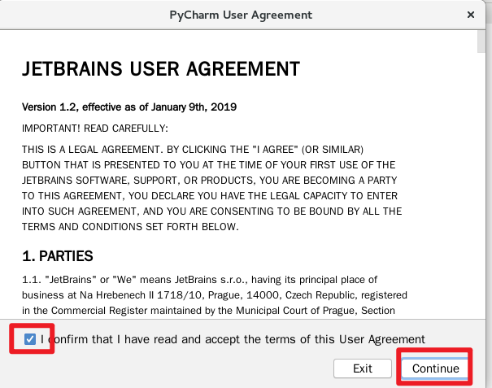
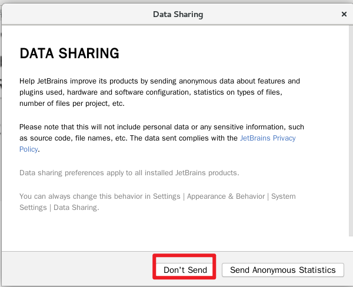
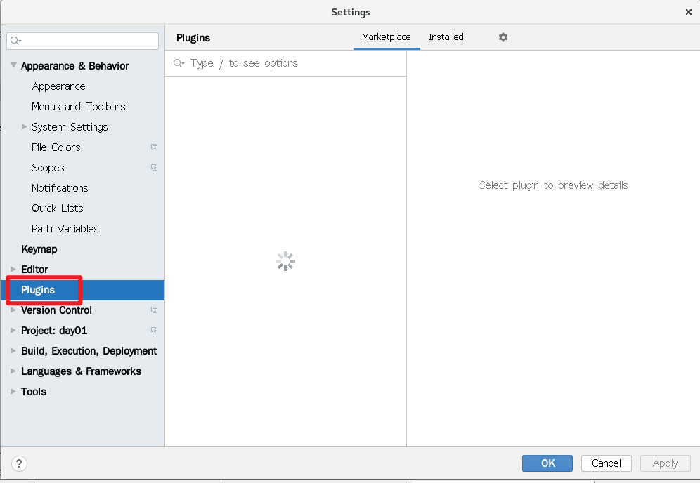

## NSD2003－PY01－DAY01

## 环境准备

- 使用国内开源镜像安装python3

```shell
[root@localhost nsd2020]# cd /etc/yum.repos.d/
[root@localhost yum.repos.d]# mkdir repoback 
[root@localhost yum.repos.d]# mv *.repo repoback
# 网易开源镜像站点：http://mirrors.163.com/
[root@localhost yum.repos.d]# wget http://mirrors.163.com/.help/CentOS7-Base-163.repo
[root@localhost yum.repos.d]# yum install -y gcc python3 python3-devel
[root@localhost yum.repos.d]# python3 --version
Python 3.6.8
```

- 配置ide（集成开发环境）：PyCharm
- PyCharm分为付费的专业版和免费的社区版。免费的社区版只能写纯python代码；付费的专业版功能更强大，它提供了30天的免费试用
- 下载：https://download.jetbrains.com/python/pycharm-professional-2020.1.1.tar.gz?_ga=2.26794557.1297218427.1597111767-1558405450.1596415480
- 安装

```shell
[root@localhost 下载]# tar xf pycharm-professional-2020.1.1.tar.gz 
[root@localhost 下载]# mkdir -p /root/bin
[root@localhost 下载]# mv pycharm-2020.1.1 /root/bin/
# 安装主菜单应用
[root@localhost 下载]# yum install -y alacarte
# 点击[应用程序]-> [杂项] -> [主菜单]。在编程中，点击新建项目
```


name: PyCharm2020;  

Command: /root/bin/pycharm-2020.1.1/bin/pycharm.sh

图标位置：/root/bin/pycharm-2020.1.1/bin/pycharm.png

点击[应用程序] -> [编程] -> PyCharm2020








插件中搜索并安装chinese...（汉化），rainbow brackets，Translation（翻译）


