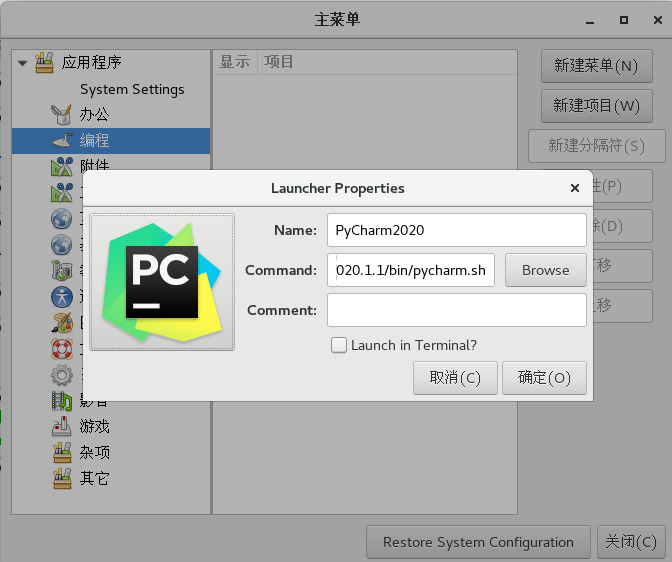

## NSD2003－PY01－DAY01

## 环境准备

- 使用国内开源镜像安装python3

```shell
[root@localhost nsd2020]# cd /etc/yum.repos.d/
[root@localhost yum.repos.d]# mkdir repoback 
[root@localhost yum.repos.d]# mv *.repo repoback
# 网易开源镜像站点：http://mirrors.163.com/
[root@localhost yum.repos.d]# wget http://mirrors.163.com/.help/CentOS7-Base-163.repo
[root@localhost yum.repos.d]# yum install -y gcc python3 python3-devel
[root@localhost yum.repos.d]# python3 --version
Python 3.6.8
```

- 配置ide（集成开发环境）：PyCharm
- PyCharm分为付费的专业版和免费的社区版。免费的社区版只能写纯python代码；付费的专业版功能更强大，它提供了30天的免费试用
- 下载：https://download.jetbrains.com/python/pycharm-professional-2020.1.1.tar.gz?_ga=2.26794557.1297218427.1597111767-1558405450.1596415480
- 安装

```shell
[root@localhost 下载]# tar xf pycharm-professional-2020.1.1.tar.gz 
[root@localhost 下载]# mkdir -p /root/bin
[root@localhost 下载]# mv pycharm-2020.1.1 /root/bin/
# 安装主菜单应用
[root@localhost 下载]# yum install -y alacarte
# 点击[应用程序]-> [杂项] -> [主菜单]。在编程中，点击新建项目
```




name: PyCharm2020;  

Command: /root/bin/pycharm-2020.1.1/bin/pycharm.sh

图标位置：/root/bin/pycharm-2020.1.1/bin/pycharm.png

点击[应用程序] -> [编程] -> PyCharm2020


插件中搜索并安装chinese...（汉化），rainbow brackets，Translation（翻译）


## Python起步

- 运行方法一：使用交互解释器

```python
[root@localhost day01]# python3
>>> print('Hello World!')
Hello World!
>>> exit
Use exit() or Ctrl-D (i.e. EOF) to exit
```

- 运行方法二：使用文件的方式

```shell
[root@localhost day01]# cat hello.py 
print('Hello World!')
[root@localhost day01]# python3 hello.py 
Hello World!
```

### Python语法结构

- Python靠缩进表达代码逻辑，建议缩4个空格
- 注释、续行和同行多条语句与shell一样。在pycharm中，选中多行，按`ctrl + /`进行注释或取消注释。

### 输出语句

- 在python中主要使用print实现输出，print是一个函数
- 在python中函数调用需要添加()，括号内是传给函数的参数

```python
>>> print("hello world!")   # 打印一个字符串，单双引号没有区别，但是必须有
hello world!

# 在print函数的()中，输入的是参数，各个参数之间用逗号隔开
>>> print("hao", 123)       # 打印字符串和数字
hao 123

# print函数输出的各项之间，默认用空格分隔，可以通过sep指定分隔符
>>> print("hao", 123, "abc")
hao 123 abc
>>> print("hao", 123, "abc", sep="***")
hao***123***abc
```

### 输入语句

- python中，通过input函数获取用户键盘输入
- input函数的参数是字符串，它是屏幕提示语

```python
# 变量赋值，=两边空格可有可无
>>> user = input('username: ')   # 用户输入内容保存到变量user中
username: tom
>>> user    # 使用变量
'tom'

# input读入的数据都是字符串类型。相同类型的数据才能运算
>>> num = input("number: ")
number: 10
>>> num + 5    # num是字符串，不能和数字进行运算
Traceback (most recent call last):
  File "<stdin>", line 1, in <module>
TypeError: must be str, not int
>>> type(num)    # 查看num的类型
<class 'str'>
>>> int(num) + 5  # int函数将字符串转成整数
15
>>> num + str(5)  # str函数将对象转成字符串
'105'
>>> num + "5"
'105'
```

