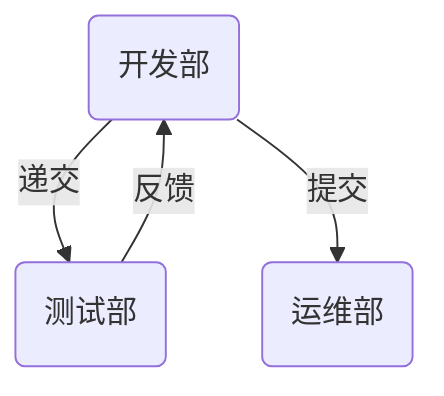
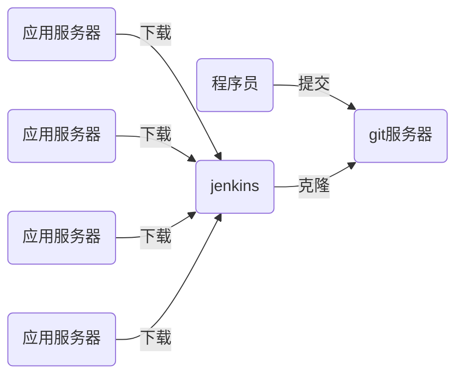

# nsd2008-devops-day04

[TOC]

## CI/CD

- CI/CD：持续集成、持续交付

- 程序传统上线流程



- 程序语言分类
  - 解释执行：python / shell / php
  - 编译执行：c / c++ / go / java

- CI/CD流程



## git应用

- 安装与配置

```shell
[root@dev ~]# yum install -y git
[root@dev ~]# git config --global user.name zhangzhg
[root@dev ~]# git config --global user.email zhangzg@tedu.cn
[root@dev ~]# git config --global core.editor vim
[root@dev ~]# git config --list
user.name=zhangzhg
user.email=zhangzg@tedu.cn
core.editor=vim
```

- 电子书推荐：https://git-scm.com/book/zh/v2
- git重要的工作区域
  - 工作区：项目目录
  - 暂存区：工作区和版本库之间的缓冲地带，也叫stage或index。位于.git/index
  - 版本库：快照存储区域，工作区下的.git目录


- 文件状态
  - 未跟踪：工作区中的文件，尚未执行add操作
  - 已跟踪：
    - 已暂存：通过git add将文件放到暂存区
    - 未修改：git commit后，没有再做修改。工作区文件内容与版本库中的一致
    - 已修改：git commit后，修改文件，但是没有执行git add操作

- 操作

```shell
# 创建版本库，方法一
[root@dev ~]# mkdir projects; cd projects
[root@dev projects]# git init mytest
初始化空的 Git 版本库于 /root/projects/mytest/.git/
[root@dev projects]# ls
mytest
[root@dev projects]# ls -A mytest/
.git

# 创建版本库，方法二
[root@dev projects]# mkdir myweb; cd myweb
[root@dev myweb]# echo 'Hello World' > readme.md
[root@dev myweb]# git init
初始化空的 Git 版本库于 /root/projects/myweb/.git/
[root@dev myweb]# ls -A
.git  readme.md

# 查看文件状态
[root@dev myweb]# git status
# 位于分支 master
#
# 初始提交
#
# 未跟踪的文件:
#   （使用 "git add <file>..." 以包含要提交的内容）
#
#	readme.md
提交为空，但是存在尚未跟踪的文件（使用 "git add" 建立跟踪）

# 暂存目录下所有文件
[root@dev myweb]# git add .
[root@dev myweb]# git status
# 位于分支 master
#
# 初始提交
#
# 要提交的变更：
#   （使用 "git rm --cached <file>..." 撤出暂存区）
#
#	新文件：    readme.md
#

# 提交文件
[root@dev myweb]# git commit -m "project init"

# 修改文件
[root@dev myweb]# echo '2nd line' >> readme.md 
[root@dev myweb]# git status
# 位于分支 master
# 尚未暂存以备提交的变更：
#   （使用 "git add <file>..." 更新要提交的内容）
#   （使用 "git checkout -- <file>..." 丢弃工作区的改动）
#
#	修改：      readme.md
#
修改尚未加入提交（使用 "git add" 和/或 "git commit -a"）
# 提交修改内容到版本库
[root@dev myweb]# git add .
[root@dev myweb]# git commit -m "modify readme.md"


# 创建.gitignore来阻止某些文件加入到跟踪
[root@dev myweb]# echo '8-1 xxxx' > plan.txt
[root@dev myweb]# echo '8-2 aaaa' >> plan.txt 
[root@dev myweb]# vim .gitignore
plan.txt
*.swp
.gitignore
[root@dev myweb]# git status
# 位于分支 master
无文件要提交，干净的工作区


[root@dev myweb]# echo 'new line' >> readme.md 
[root@dev myweb]# git status
# 位于分支 master
# 尚未暂存以备提交的变更：
#   （使用 "git add <file>..." 更新要提交的内容）
#   （使用 "git checkout -- <file>..." 丢弃工作区的改动）
#
#	修改：      readme.md
#
修改尚未加入提交（使用 "git add" 和/或 "git commit -a"）

# 丢弃工作区改动。慎用！！！它会将工作区所有更改清理掉。
[root@dev myweb]# git checkout -- readme.md
[root@dev myweb]# git status
# 位于分支 master
无文件要提交，干净的工作区
[root@dev myweb]# cat readme.md 
Hello World
2nd line

# 技巧。如果发送的git目录太大，可以把工作区内容删除。接收方再恢复
# 发送方
[root@localhost ~]# cp -r nsd2020/ /tmp/
[root@localhost tmp]# du -sh nsd2020/
47M	nsd2020/
[root@localhost tmp]# cd nsd2020/
[root@localhost nsd2020]# ls
ebooks  nsd1912  nsd2003  README.en.md  README.md  review
[root@localhost nsd2020]# rm -rf *
[root@localhost nsd2020]# du -sh .
14M	.
# 接收方
[root@localhost nsd2020]# git checkout -- *
[root@localhost nsd2020]# ls
ebooks  nsd1912  nsd2003  README.en.md  README.md  review
[root@localhost nsd2020]# du -sh .
46M	.

# 撤出暂存区
[root@dev myweb]# echo '2nd line.' >> readme.md 
[root@dev myweb]# echo '3rd line.' >> readme.md 
[root@dev myweb]# git add .
[root@dev myweb]# git status
# 位于分支 master
# 要提交的变更：
#   （使用 "git reset HEAD <file>..." 撤出暂存区）
#
#	修改：      readme.md
#
####### 此时，发现readme.md没有修改完，需要继续修改#####
[root@dev myweb]# git reset HEAD readme.md
重置后撤出暂存区的变更：
M	readme.md
[root@dev myweb]# git status
# 位于分支 master
# 尚未暂存以备提交的变更：
#   （使用 "git add <file>..." 更新要提交的内容）
#   （使用 "git checkout -- <file>..." 丢弃工作区的改动）
#
#	修改：      readme.md
#
修改尚未加入提交（使用 "git add" 和/或 "git commit -a"）
[root@dev myweb]# cat readme.md   # 新增加的行仍然在
Hello World!
2nd line
3rd line.
[root@dev myweb]# echo '4th line.' >> readme.md 
[root@dev myweb]# git add .
[root@dev myweb]# git commit -m "add lines to readme.md"


# 在git操作中，没有单独的复制，因为复制就是在工作区增加了一个文件
# 移动/改名
[root@dev myweb]# git mv readme.md readme
[root@dev myweb]# git status
# 位于分支 master
# 要提交的变更：
#   （使用 "git reset HEAD <file>..." 撤出暂存区）
#
#	重命名：    readme.md -> readme
#
[root@dev myweb]# git commit -m "modify readme.md => readme"

# 删除
[root@dev myweb]# git rm readme
rm 'readme'
[root@dev myweb]# ls
plan.txt
[root@dev myweb]# git status
# 位于分支 master
# 要提交的变更：
#   （使用 "git reset HEAD <file>..." 撤出暂存区）
#
#	删除：      readme
#
[root@dev myweb]# git commit -m "remove readme"

# 查看版本库的文件
[root@dev myweb]# git ls-files
# 查看所有的commit
[root@dev myweb]# git log
commit 0925d232fbd10ef34a01411eb6e6749e52c49341
Author: zhangzhg <zhangzg@tedu.cn>
Date:   Fri Jul 31 11:43:17 2020 +0800

    remove readme

commit bc2c22d43400579dba6dd222c8ced5dc56dd8e30
Author: zhangzhg <zhangzg@tedu.cn>
Date:   Fri Jul 31 11:42:22 2020 +0800

    modify readme.md => readme
... ...
# 返回到某一个时间点的快照
[root@dev myweb]# git checkout bc2c22d43400579dba6dd222c8ced5dc56dd8e30
root@dev myweb]# ls
plan.txt  readme

# 回到最新的master状态
[root@dev myweb]# git checkout master
之前的 HEAD 位置是 bc2c22d... modify readme.md => readme
切换到分支 'master'
[root@dev myweb]# ls
plan.txt

# 查看当前所在版本
[root@dev myweb]# git rev-parse HEAD
```

- tag标记，可以将某一次提交打标记，以示本提交重要。通常用于将某次提交标记为一个版本

```shell
# 查看所有的tag
[root@dev myweb]# git tag
# 为现在的版本打标记为1.0
[root@dev myweb]# git tag 1.0
[root@dev myweb]# git tag
1.0
```

### 分支

- 使用分支意味着你可以把你的工作从开发主线上分离开来，以免影响开发主线。

```shell
# 查看分支
[root@dev myweb]# git branch 
* master
# 创建名为b1的分支
[root@dev myweb]# git branch b1
[root@dev myweb]# git branch 
  b1
* master  # 当前在哪个分支，前面有*标识
# 切换分支
[root@dev myweb]# git checkout b1
切换到分支 'b1'
[root@dev myweb]# git branch 
* b1
  master
# 在分支上提交代码
[root@dev myweb]# cp /etc/hosts .
[root@dev myweb]# git add .
[root@dev myweb]# git commit -m "add hosts"
[root@dev myweb]# ls
hosts  plan.txt

# 合并b1分支到master
[root@dev myweb]# git checkout master
切换到分支 'master'
[root@dev myweb]# ls
plan.txt
[root@dev myweb]# git merge b1 -m "merge b1 to master"
[root@dev myweb]# ls
hosts  plan.txt
```

## gitlab

- 安装

```shell
[root@gitserver ~]# cd docker/
[root@gitserver docker]# ls
docker_rpms  images
[root@gitserver docker]# yum install -y docker_rpms/*rpm
[root@gitserver docker]# systemctl start docker
[root@gitserver docker]# systemctl enable docker
[root@gitserver docker]# docker load -i images/gitlab_zh.tar 
[root@gitserver ~]# vim /etc/ssh/sshd_config 
Port 2022
[root@gitserver ~]# systemctl restart sshd
# 如果有客户端连接，需要客户端重新连接
[root@gitserver ~]# docker run -d -h gitlab --name gitlab -p 443:443 -p 80:80 -p 22:22 --restart always -v /srv/gitlab/config:/etc/gitlab -v /srv/gitlab/logs:/var/log/gitlab -v /srv/gitlab/data:/var/opt/gitlab gitlab_zh:latest 
[root@gitserver ~]# docker ps  # 直到状态成为healthy才可用
```

- 访问gitlab：http://192.168.1.102/ 。第一次访问时，需要为root用户配置复杂密码。
- 在首页上点击扳手图标，左边栏下面找到外观，可以修改登陆页面信息。

- gitlab中重要的概念
  - 用户：为每个使用gitlab的人创建帐号
  - 组：一般对应一个开发团队，包括成员
  - 项目：对应开发项目。可以为个人或组创建项目。

- 客户端推送代码到gitlab

```shell
[root@dev myweb]# git remote add origin http://192.168.1.102/devops/myweb.git
[root@dev myweb]# git push -u origin --all  # 推送所有分支
Username for 'http://192.168.1.102': zzg
Password for 'http://zzg@192.168.1.102': 
[root@dev myweb]# git push -u origin --tags  # 推送tag
Username for 'http://192.168.1.102': zzg
Password for 'http://zzg@192.168.1.102': 

# 配置ssh免密上传
[root@dev myweb]# ssh-keygen 
[root@dev myweb]# cat ~/.ssh/id_rsa.pub 
# 将查看到的公钥，粘贴到gitlab用户设置的ssh公钥中
# 重新绑定远程仓库
[root@dev myweb]# git remote -v
origin	http://192.168.1.102/devops/myweb.git (fetch)
origin	http://192.168.1.102/devops/myweb.git (push)
[root@dev myweb]# git remote remove origin
[root@dev myweb]# git remote -v
[root@dev myweb]# git remote add origin git@192.168.1.102:devops/myweb.git
# 上传测试
[root@dev myweb]# echo '<h1>Hello World</h1>' > index.html
[root@dev myweb]# git add .
[root@dev myweb]# git commit -m "add index.html"
[root@dev myweb]# git tag 2.0
[root@dev myweb]# git push -u origin --all
[root@dev myweb]# git push -u origin --tags
```

> 下载明天要用到的软件包：https://mirrors.tuna.tsinghua.edu.cn/jenkins/redhat-stable/
>
> https://mirrors.tuna.tsinghua.edu.cn/jenkins/redhat-stable/jenkins-2.235.1-1.1.noarch.rpm
