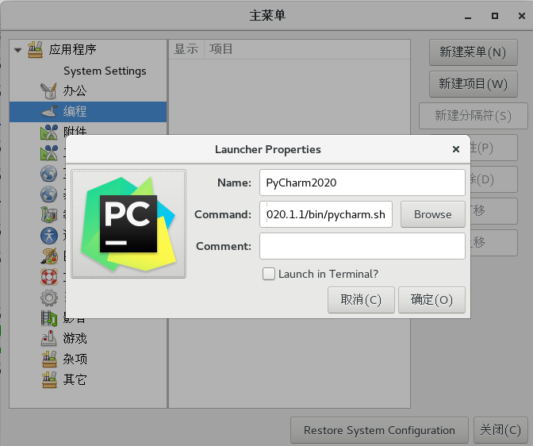
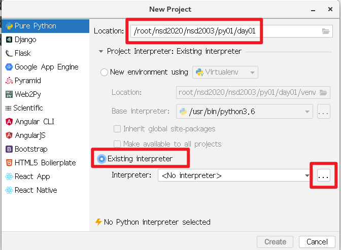
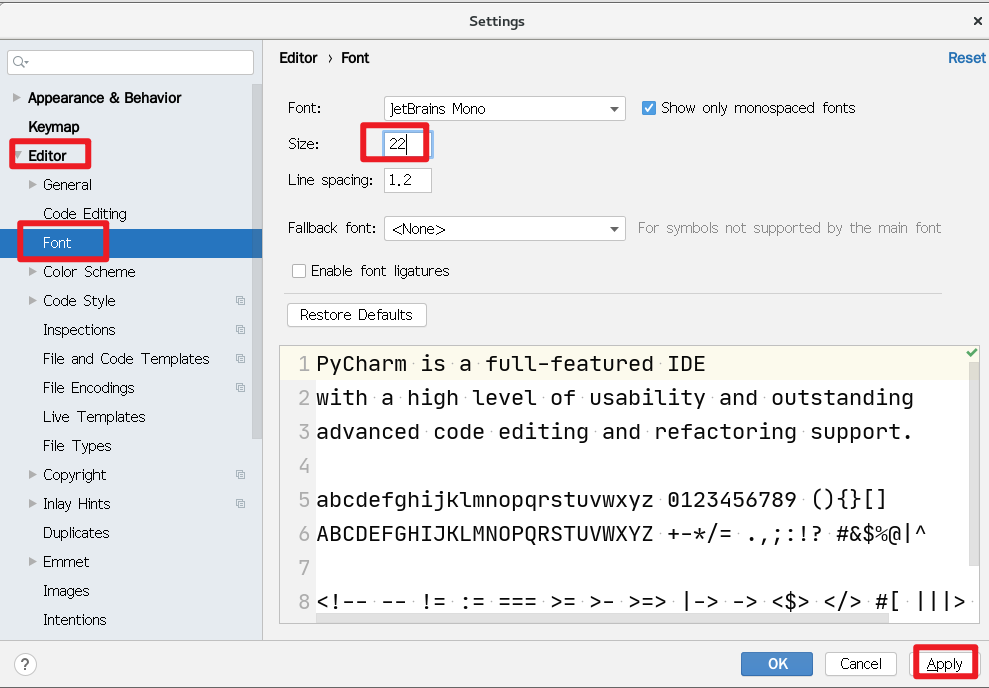

# NSD2011－PY01－DAY01

[TOC]

## 环境准备

- 使用国内开源镜像安装python3

```shell
[root@localhost nsd2020]# cd /etc/yum.repos.d/
[root@localhost yum.repos.d]# mkdir repoback 
[root@localhost yum.repos.d]# mv *.repo repoback
# 网易开源镜像站点：http://mirrors.163.com/
[root@localhost yum.repos.d]# wget http://mirrors.163.com/.help/CentOS7-Base-163.repo
[root@localhost yum.repos.d]# yum install -y gcc python3 python3-devel
[root@localhost yum.repos.d]# python3 --version
Python 3.6.8
```

- 配置ide（集成开发环境）：PyCharm
- PyCharm分为付费的专业版和免费的社区版。免费的社区版只能写纯python代码；付费的专业版功能更强大，它提供了30天的免费试用
- 下载：https://download.jetbrains.com/python/pycharm-professional-2020.1.1.tar.gz?_ga=2.26794557.1297218427.1597111767-1558405450.1596415480
- 安装

```shell
[root@localhost 下载]# tar xf pycharm-professional-2020.1.1.tar.gz 
[root@localhost 下载]# mkdir -p /root/bin
[root@localhost 下载]# mv pycharm-2020.1.1 /root/bin/
# 安装主菜单应用
[root@localhost 下载]# yum install -y alacarte
# 点击[应用程序]-> [杂项] -> [主菜单]。在编程中，点击新建项目
```




name: PyCharm2020;  

Command: /root/bin/pycharm-2020.1.1/bin/pycharm.sh

图标位置：/root/bin/pycharm-2020.1.1/bin/pycharm.png

点击[应用程序] -> [编程] -> PyCharm2020





插件中搜索并安装chinese...（汉化），rainbow brackets，Translation（翻译）




## Python起步

- 运行方法一：使用交互解释器

```python
[root@localhost day01]# python3
>>> print('Hello World!')
Hello World!
>>> exit
Use exit() or Ctrl-D (i.e. EOF) to exit
```

- 运行方法二：使用文件的方式

```shell
[root@localhost day01]# cat hello.py 
print('Hello World!')
[root@localhost day01]# python3 hello.py 
Hello World!
```

### Python语法结构

- python官方手册：https://docs.python.org/zh-cn/3.6/library/index.html

- Python靠缩进表达代码逻辑，建议缩4个空格
- 注释、续行和同行多条语句与shell一样。在pycharm中，选中多行，按`ctrl + /`进行注释或取消注释。

### 输出语句

- 在python中主要使用print实现输出，print是一个函数
- 在python中函数调用需要添加()，括号内是传给函数的参数

```python
>>> print("hello world!")   # 打印一个字符串，单双引号没有区别，但是必须有
hello world!

# 在print函数的()中，输入的是参数，各个参数之间用逗号隔开
>>> print("hao", 123)       # 打印字符串和数字
hao 123

# print函数输出的各项之间，默认用空格分隔，可以通过sep指定分隔符
>>> print("hao", 123, "abc")
hao 123 abc
>>> print("hao", 123, "abc", sep="***")
hao***123***abc
```

### 输入语句

- python中，通过input函数获取用户键盘输入
- input函数的参数是字符串，它是屏幕提示语

```python
# 变量赋值，=两边空格可有可无
>>> user = input('username: ')   # 用户输入内容保存到变量user中
username: tom
>>> user    # 使用变量
'tom'

# input读入的数据都是字符串类型。相同类型的数据才能运算
>>> num = input("number: ")
number: 10
>>> num + 5    # num是字符串，不能和数字进行运算
Traceback (most recent call last):
  File "<stdin>", line 1, in <module>
TypeError: must be str, not int
>>> type(num)    # 查看num的类型
<class 'str'>
>>> int(num) + 5  # int函数将字符串转成整数
15
>>> num + str(5)  # str函数将对象转成字符串
'105'
>>> num + "5"
'105'
```

## 变量

- 字面量就是看到什么是什么，如'abc'，100
- 变量是变化的量，看到什么不一定是什么。
- 变量只是为了编写代码方便。当看到变量时，应该透过变量看到它代表的值
- 编写代码时尽量多的使用变量，而不是直接使用字面量。直接使用字面量，是硬编码，代码可重用性差。
- 变量名称约定
  - 第一个字符只能是大小写字母或下划线
  - 后续字符只能是大小写字母或数字或下划线
  - 区分大小写
- 推荐采用的命名方法
  - 变量名全部采用小写字母，如pythonstring
  - 简短、有意义，如pystr
  - 多个单词间用下划线分隔，如py_str
  - 变量名用名词，函数名用谓词（动词+名词），如 phone / update_phone
  - 类名采用驼峰形式，如MyClass
- 变量在使用之前，必须先进行赋值
- 变量赋值是一个自右向左的运算，将=右边表达式的计算结果，赋值给左边的变量

```python
>>> a = 10 + 5
>>> a
15
```

- 变量支持重新赋值

```python
>>> a = 20
>>> a = a + 10   # 将a+10的结果再赋值给a
# 以上代码可以简写为
>>> a += 10
# 根据以上写法，举一反三
>>> a -= 20
>>> a
20
>>> a *= 2
>>> a
40
```

> 注意：Python不支持诸如i++ / i--之类的操作
>
> ```python
> >>> a = 40
> >>> ++a     # 正正为正
> 40
> >>> --a     # 负负为正
> 40
> >>> import this    # 导入python之禅
> The Zen of Python, by Tim Peters
> 
> Beautiful is better than ugly.     美胜丑
> Explicit is better than implicit.  明胜暗
> Simple is better than complex.     简胜繁
> ```

## 运算符

#### 算术运算符

```python
# 加减乘正常运算
# /是真正的除法
>>> 5 / 3
1.6666666666666667
# //只保留商
>>> 5 // 3
1
# %是模运算，即求余
>>> 5 % 3
2
# **是幂运算
>>> 2 ** 3
8
# 通过round函数实现四舍五入
>>> round(5 / 3)     # 5/3，默认保留到整数部分
2
>>> round(5 / 3, 2)  # 精确到小数点后2位
1.67
# 精准的数学中，是4舍6入5成双
>>> round(5 / 2)  # 2.5取双数，所以结果是2
2
# divmod函数，可以同时得到商和余数
>>> divmod(5, 3)
(1, 2)
>>> a, b = divmod(5, 3)  # 商和余数分别赋值给a和b
>>> a
1
>>> b
2
```

#### 比较运算符

```python
>>> 5 > 3
True
>>> 5 >= 5
True
>>> 5 < 10
True
>>> 5 <= 10
True

# 判断是否相等使用==
>>> 3 == 3
True    # True是关键字，表示真
# 判断是否不相等使用!=
>>> 3 != 3
False    # False是关键字，表示假
# python支持连续比较
>>> 10 < 20 < 30
True
```

#### 逻辑运算符

```python
# and两边表达式结果全为True，最终才为True
>>> 10 < 20 and 20 > 15
True
# or两边表达式结果全为False，最终才为False
>>> 10 < 20 or 20 > 100
True
>>> 100 < 20 or 20 > 100
False
# not是单目运算符，将真变假，将假变真
>>> 20 > 10
True
>>> not 20 > 10
False
```

## 数据类型

- 内置函数：https://docs.python.org/zh-cn/3.6/library/functions.html

#### 数字

- 整数：没有小数点
- 浮点数：有小数点
- 布尔数：True为1，False为0

```python
>>> True + 1
2
>>> False * 5
0
```

- 整数在不同进制下的表示方法

```python
# python默认以10进制表示数字
>>> 11
11
# 8进制以0o或0O开头
>>> 0o11
9   # 默认以10进制输出
# 16进制以0x或0X开头
>>> 0x11
17
# 2进制以0b或0B开头
>>> 0b11
3

# 2小时3分5秒是多少秒？
>>> 2 * 60 * 60 + 3 * 60 + 5
7385
# 0x235 转成10进制怎么算？ 
>>> 2 * 16 * 16 + 3 * 16 + 5
565
>>> 0x235
565
# 0o235 转成10进制怎么算？ 
>>> 2 * 8 * 8 + 3 * 8 + 5
157
>>> 0o235
157

# 10000秒是几小时几分几秒？
>>> divmod(10000, 60)
(166, 40)  -> 166分40秒
>>> divmod(166, 60)
(2, 46)    -> 2小时46分

# 10000转换成16进制数是？
>>> divmod(10000, 16)
(625, 0)
>>> divmod(625, 16)
(39, 1)
>>> divmod(39, 16)
(2, 7)
# 10000 -> 0x2710
>>> hex(10000)
'0x2710'
```

#### 字符串

- python中字符串被定义为引号之间的字符集合
- python支持使用成对的单引号或双引号
- 无论单引号，还是双引号，表示的意义相同
- python还支持三引号（三个连续的单引号或者双引号），可以用来包含特殊字符

```python
>>> s1 = """tom
... jerry
... jack
... rose
... """
>>> print(s1)
tom
jerry
jack
rose

>>> s1
'tom\njerry\njack\nrose\n'
>>> s2 = "bj\ntj\nxa\nzz"
>>> print(s2)
bj
tj
xa
zz
```

- 常见操作

```python
>>> s1 = 'python'
>>> len(s1)   # 取长度
6
>>> s1[0]     # 第一个字符，下标为0
'p'
>>> s1[6]     # 下标为6，超出范围，报错
Traceback (most recent call last):
  File "<stdin>", line 1, in <module>
IndexError: string index out of range
>>> s1[5]
'n'
>>> s1[-1]  # 负数表示从右向左，最右的一个字符
'n'
>>> s1[-6]  # 自右向左第6个字符
'p'
>>> s1[2:4]  # 切片，起始下标包含，结束下标不包含。含头不含尾，也可以叫左闭右开
'th'
>>> s1[2:6]  # 切片时，下标超出范围是允许的
'thon'
>>> s1[2:600]
'thon'
>>> s1[2:]   # 结束下标不写，表示取到结尾
'thon'
>>> s1[:2]   # 起始下标不写，表示从开头取
'py'
>>> s1[:]    # 从开头取到结尾
'python'
>>> s1[::2]  # 步长值为2，取切片
'pto'
>>> s1[1::2]
'yhn'
>>> s1[::-1]  # 步长为负，表示自右向左取
'nohtyp'


>>> 't' in s1          # t在s1中吗？
True
>>> 'th' in s1         # th在s1中吗？
True
>>> 'to' in s1         # to在s1中吗？
False
>>> 'to' not in s1     # to不在s1中吗？
True

>>> s1 + ' is good'    # 字符串拼接
'python is good'
>>> '*' * 30   # 字符串*重复30遍
'******************************'
>>> '#' * 30
'##############################'
>>> s1 * 3
'pythonpythonpython'
```

#### 列表

- 列表可以当作数组使用
- 字符串的相关操作同样适用于列表

```python
>>> l1 = [10, 20, 5, 30, 8]
>>> len(l1)
5
>>> l1[0]
10
>>> l1[2:4]
[5, 30]
>>> 20 in l1
True
>>> l1.append(20)   # 向列表尾部追加数字20
>>> l1
[10, 20, 5, 30, 8, 20]
```

#### 元组

- 可以理解为元组是不可变的列表
- 列表的相关操作同样适用于元组

```python
>>> t = (10, 20, 8, 38)
>>> len(t)
4
>>> 10 in t
True
>>> t[2]
8

>>> l1[0] = 100   # 将列表第一项改为100
>>> l1
[100, 20, 5, 30, 8, 20]
>>> t
(10, 20, 8, 38)
>>> t[0]
10
>>> t[0] = 100   # 元组不可变，报错
Traceback (most recent call last):
  File "<stdin>", line 1, in <module>
TypeError: 'tuple' object does not support item assignment
```

#### 字典

- 字典是由键-值(key-value)对构成的映射数据类型
- 通过键取值，不支持下标操作

```python
>>> d1 = {"name": "tom", "age": 20}
>>> len(d1)
2
>>> 'tom' in d1   # tom是字典的key吗
False
>>> 'name' in d1  # name是字典的key吗
True
>>> d1['name']    # 通过key取value
'tom'
```

### 数据类型总结

#### 按存储模型分类

- 标量：字符串、数字
- 容器：列表、元组、字典

#### 按访问模型分类

- 直接：数字
- 顺序：字符串、列表、元组
- 映射：字典

#### 按更新模型分类

- 不可变：数字、字符串、元组
- 可变：列表、字典

```python
>>> s1 = 'python'
>>> l1 = [10, 20, 30]
>>> s1[0]
'p'
>>> l1[0]
10
>>> l1[0] = 100
>>> s1[0] = 'P'   # 字符串不可变，不能对它直接修改
Traceback (most recent call last):
  File "<stdin>", line 1, in <module>
TypeError: 'str' object does not support item assignment
>>> s1 = 'Python'  # 整体重新赋值

>>> l1
[100, 20, 30]
>>> l2 = l1     # l1和l2指向内存的相同地址
>>> l2
[100, 20, 30]
>>> l2[-1] = 300  # 修改l2也会影响到l1
>>> l2
[100, 20, 300]
>>> l1
[100, 20, 300]
```

思考题：

1. 有如下的数据结构：

```pyhton
users = [(1, 'tom'), (2, 'jerry'), (3, 'bob')]
```

如果只想取出jerry，该怎么办？

2. 有如下的数据结构

```python
users = [{'name': 'nb', 'age': 20}, {'name': 'plj', 'age': 18}]
```

如果想取出nb和20，该怎么办？


